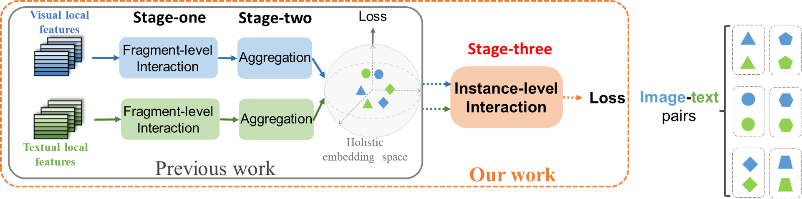

# Learning Semantic Relationship among Instances for Image-Text Matching


The codes for our paper "[Learning Semantic Relationship among Instances for Image-Text Matching](https://openaccess.thecvf.com/content/CVPR2023/html/Fu_Learning_Semantic_Relationship_Among_Instances_for_Image-Text_Matching_CVPR_2023_paper.html)", which is accepted by the  IEEE/CVF Conference on Computer Vision and Pattern Recognition, 2023.
We referred to the implementations of [GPO](https://github.com/woodfrog/vse_infty), [VSE++](https://github.com/fartashf/vsepp), [SCAN](https://github.com/kuanghuei/SCAN), and [NAAF](https://github.com/CrossmodalGroup/NAAF) to build up our codes. 


## Introduction

Image-text matching, a bridge connecting image and language, is an important task, which generally learns a holistic cross-modal embedding to achieve a high-quality semantic alignment between the two modalities. 


However, previous studies only focus on capturing fragment-level relation within a sample from a particular modality, e.g., salient regions in an image or text words in a sentence, where they usually pay less attention to capturing instance-level interactions among samples and modalities, e.g., multiple images and texts. In this paper, we argue that sample relations could help learn subtle differences for hard negative instances, and thus transfer shared knowledge for infrequent samples should be promising in obtaining better holistic embeddings. Therefore, we propose a novel hierarchical relation modeling framework (HREM), which explicitly capture both fragment- and instance-level relations to learn discriminative and robust cross-modal embeddings. Extensive experiments on Flickr30K and MS-COCO show our proposed method outperforms the state-of-the-art methods.


## Preparation

### Environments
We recommend the following key dependencies.

- python >= 3.8
- torch >= 1.7.0
- torchvision >= 0.8.0
- transformers >=2.1.1
- opencv-python
- tensorboard


### Data
We organize all dataset in the following manner like [GPO](https://github.com/woodfrog/vse_infty), we first need download the pre-computed BUTD region features provides by [SCAN](https://www.kaggle.com/datasets/kuanghueilee/scan-features) (The official authors). You also can download the dataset through Baidu Cloud. Download links are [Flickr30K](https://pan.baidu.com/share/init?surl=Fr_bviuWLcrJ9MiiRn_H2Q) and [MSCOCO](https://pan.baidu.com/share/init?surl=vp3gtQhT7GO0PQACBSnOrQ), the extraction code is: USTC.

We need get the pretrained checkpoint files for [BERT-base](https://huggingface.co/bert-base-uncased) model. You also can use the pretrained checkpoint downloaded by [transformers](https://github.com/huggingface/transformers) automatically, just set ```BertModel.from_pretrained('bert-base-uncased')``` and ```BertTokenizer.from_pretrained('bert-base-uncased')```, then the files will be downloaded at  `~/.cache`.

```
data
├── coco_precomp  # coco dataset
│   ├── train_ims.npy
│   ├── train_caps.txt
│   ├── dev_ims.npy
│   ├── dev_caps.txt
│   ├── testall_ims.npy
│   ├── testall_caps.txt
│   ├── ......
│
├── f30k_precomp  # f30k dataset
│   ├── train_ims.npy
│   ├── train_caps.txt
│   ├── dev_ims.npy
│   ├── dev_caps.txt
│   ├── test_ims.npy
│   ├── test_caps.txt
│   ├── ......
│
├── bert-base-uncased    # the pretrained ckpt files for BERT-base
│   ├── config.json
│   ├── tokenizer_config.txt
│   ├── vocab.txt
│   ├── pytorch_model.bin
│   ├── ......
│
```

## Training
We first need set up the related **arguments** for the datasets and models paths. Detailed information about the arguments can be found in ```arguments.py``` and  ```graph_lib.py```.

-  `--dataset`: the chosen datasets, e.g., `f30k` and `coco`.
-  `--data_path`: the root path of datasets, e.g., `data/`
-  `--bert_path`: the path of pretrained model files of BERT-base, e.g., `data/bert-base-uncased`
- `--gpu-id`, the chosen GPU number, e.g., 0-7
- `--logger_name`, the path of logger files, e.g., `runs/f30k_test` or `runs/coco_test`


Assuming we have set all the paths, including the model weights and the datasets, we run the ```train.py``` for training. The training script need **about 20,000 GPU-Memory** (one RTX-3090 GPU).


```
# fusion mechanism on f30k
python train.py --batch_size 128 --data_path data/ --dataset f30k --logger_name runs/f30k_test --mask_weight 1.0

# fusion mechanism on coco
python train.py --batch_size 256 --data_path data/ --dataset coco --logger_name runs/coco_test --mask_weight 1.5
```


## Evaluation
Run ```eval.py``` to evaluate the trained models on f30k or coco.

```
python eval.py  --data_path data/ --dataset f30k 
python eval.py  --data_path data/ --dataset coco 
```


## Performances
The following tables show the results of image-to-text retrieval on **MSCOCO** and **Flickr30K** datasets. In these experiments, we use the **BUTD region** featues for images, and use the **BERT-base** as the textual encoder. We also provide the training logs and checkpoint files for two datasets.


|Datasets| Interaction type |I2T R@1|I2T R@5|T2I R@1|T2I R@5|Model checkpoint|
|:---:|:---:|:---:|:---:|:---:|:---:|:---:|
|Flickr30K |Fusion |84.4|96.7|62.4|86.6|[Here](https://drive.google.com/drive/folders/1sIWjmtTNGMs8HBQhM48QR9u0twOv_rB6?usp=sharing)|
|MSCOCO-1K |Fusion |81.9|96.9|65.9|91.4|[Here](https://drive.google.com/drive/folders/1e5bGjK6Z7Cmuj0M2dIET0lbLyFMm8BiM?usp=sharing)|
|MSCOCO-5K |Fusion |62.5|87.4|44.0|73.9|as above|


## Reference

```
@InProceedings{Fu_2023_CVPR,
    author    = {Fu, Zheren and Mao, Zhendong and Song, Yan and Zhang, Yongdong},
    title     = {Learning Semantic Relationship Among Instances for Image-Text Matching},
    booktitle = {Proceedings of the IEEE/CVF Conference on Computer Vision and Pattern Recognition (CVPR)},
    month     = {June},
    year      = {2023},
    pages     = {15159-15168}
}
```
